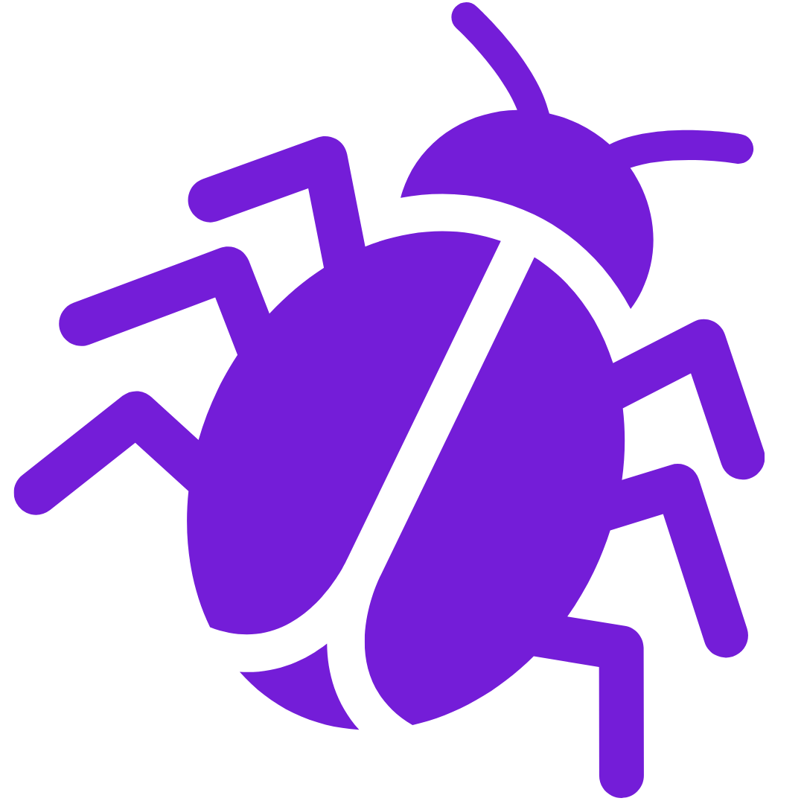

<h1 align="center">
   
  
   
  Bug_Tracker
   
</h1>

<h4 align="center">Create projects and tickets to track bugs in your next software product.</h4>

 <a href="#screenshots">Screenshots</a> •
  <a href="#demo">Demo</a> •
  <a href="#key-features">Key Features</a> •
  <a href="#Built-with">Built With</a>

## Screenshots

## Demo

* View [here](https://bug-tracker-tau.vercel.app/)

## Key Features

* Authentication and Demo User Account Access with NextAuth.js.
* User Permissions.
* Create Projects, Tickets, and Assign User Roles.
* Post comments.
* Upload images with Cloudinary.
* Ticket history tracking.
* Responsive web design.

## Built With

* JavaScript
* NextAuth.js
* Next.js
* Tailwind CSS
* Vercel
* MongoDB

